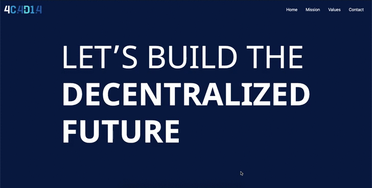

<h1 align="center">Welcome to 4CADIA Angular 🔵</h1>
<p>
  
  <a href="https://twitter.com/maisamaximo_" target="_blank">
    
  </a>
</p>

> Simple project using Angular knowledge



## Install

```sh
yarn install
```

## Usage

```sh
ng serve
```

## Author

👤 **Maisa Maximo**

* Twitter: [@maisamaximo_](https://twitter.com/maisamaximo_)
* Github: [@maisamaximo](https://github.com/maisamaximo)
* Linkedin: [Maisa Maximo](https://www.linkedin.com/in/maisa-maximo-ferreira/)

## Show your support

Give a ⭐️ if this project helped you!
